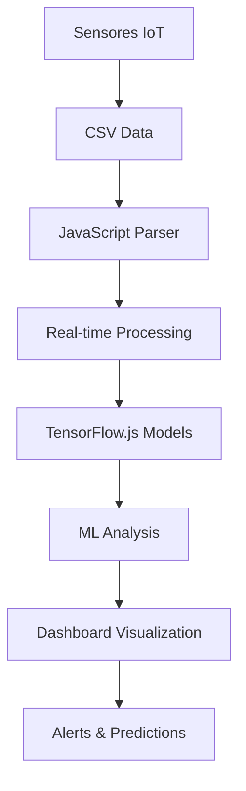

# 🐄 Cattle ML Monitor - Sistema de Monitoreo Bovino con Machine Learning


## 📖 Descripción

Sistema inteligente de monitoreo bovino con **Machine Learning** en tiempo real. Utiliza sensores IoT para analizar comportamiento animal, detectar anomalías y generar predicciones mediante **TensorFlow.js**. Dashboard profesional con análisis avanzado de datos ganaderos.

## ✨ Características Principales

### 🧠 **Machine Learning Avanzado**
- 🎯 Clasificación automática de comportamiento (descanso, caminata, pastoreo, bebiendo)
- 🔍 Detección de anomalías con redes neuronales (Autoencoder)
- 📊 Clustering K-Means para análisis de patrones
- 🔮 Predicciones de temperatura y actividad futura

### 📊 **Monitoreo en Tiempo Real**
- 📱 **Acelerómetro MPU6050**: Análisis de movimiento en 3 ejes
- 🌡️ **Sensor de Temperatura MLX90614**: Control térmico continuo
- 🔄 **Giroscopio**: Detección de orientación y rotación
- 🔋 **Monitoreo de batería**: Estado del sistema en vivo

### 🎨 **Interface Profesional**
- 🖥️ Dashboard moderno con **8+ gráficos interactivos**
- 📱 **Completamente responsive** (móvil, tablet, desktop)
- 🎨 **Paleta de colores fríos** profesional
- ⚡ **Animaciones fluidas** y UX optimizada

## 📸 Capturas del Sistema

### Dashboard Principal - Overview


### Análisis de Sensores en Tiempo Real


### Machine Learning y Clustering


### Sistema de Predicciones


## 🛠️ Tecnologías Utilizadas

| Tecnología | Uso |
|------------|-----|
| **HTML5/CSS3** | Estructura y diseño responsive |
| **JavaScript ES6+** | Lógica de aplicación y ML |
| **TensorFlow.js** | Modelos de Machine Learning |
| **Chart.js** | Gráficos interactivos |
| **MPU6050** | Sensor acelerómetro/giroscopio |
| **MLX90614** | Sensor de temperatura sin contacto |

## 🚀 Instalación y Uso

### Prerrequisitos
- Navegador web moderno (Chrome, Firefox, Safari, Edge)
- Archivo CSV con datos de sensores

### Pasos de Instalación

1. **Clonar el repositorio**
```bash
git clone https://github.com/kair069/-Cattle-ML-Monitor-Sistema-de-Monitoreo-Bovino-con-Machine-Learning.git
cd Cattle-ML-Monitor
```

2. **Preparar datos**
```bash
# Coloca tu archivo de datos como 'csv.csv' en la raíz del proyecto
# Formato esperado: sensor_id,accel_x,accel_y,accel_z,gyro_x,gyro_y,gyro_z,temp,bateria,fecha...
```

3. **Ejecutar**
```bash
# Simplemente abre index.html en tu navegador
open index.html
# o
python -m http.server 8000  # Para servidor local
```

## 📁 Estructura del Proyecto

```
📦 Cattle-ML-Monitor/
├── 📄 index.html              # Dashboard principal
├── 🎨 styles.css              # Estilos profesionales (colores fríos)
├── 🧠 script.js               # Lógica ML y análisis de datos
├── 📊 csv.csv                 # Datos de sensores (formato requerido)
├── 📖 README.md               # Documentación
├── 🗂️ parte2.html             # Módulo adicional
├── 📋 query.sql               # Consultas de base de datos
├── 📄 s (1).csv               # Datos de ejemplo
├── 📝 diccionariodatos.xlsx   # Diccionario de datos
└── 📸 capturas/               # Imágenes del sistema
    ├── imagencaptura.png
    ├── imagencaptura2 dahsborad.png
    ├── imagne dashboard1.png
    ├── ca.png
    └── captura3.png
```

## 📊 Formato de Datos CSV

El sistema espera un archivo CSV con las siguientes columnas:

```csv
sensor_id,id_collar,accel_x,accel_y,accel_z,gyro_x,gyro_y,gyro_z,temp,bateria,fecha,vaca_id,nombre_vaca,collar_codigo
622,1,10.05,0.45,0.26,-0.09,-0.01,-0.02,23.13,3.85,2025-07-16 17:13:32,1,Vaca Prueba,COLLAR-001
```

## 🎯 Funcionalidades por Sección

### 📈 **Overview**
- Estadísticas generales del ganado
- Gráfico de actividad en tiempo real
- Indicadores de salud automáticos

### 🔬 **Sensores**
- Lecturas en vivo de acelerómetro (X, Y, Z)
- Datos del giroscopio en °/s
- Temperatura ambiente y corporal
- Estado de batería del collar

### 🧠 **Análisis ML**
- Clasificación de comportamiento con IA
- Clustering K-Means de actividades
- Detección automática de anomalías
- Métricas de precisión del modelo

### 🔮 **Predicciones**
- Comportamiento futuro (1h, 3h, 6h)
- Tendencias de temperatura
- Alertas preventivas

### 🚨 **Sistema de Alertas**
- Configuración de umbrales personalizables
- Notificaciones automáticas
- Alertas de temperatura, actividad y batería

## 🎛️ Algoritmos de Machine Learning

### 1. **Clasificador de Comportamiento**
```javascript
// Red neuronal con TensorFlow.js
- Input: [accel_x, accel_y, accel_z, gyro_x, gyro_y, gyro_z]
- Capas: Dense(16) → Dropout(0.3) → Dense(8) → Dense(4)
- Output: [Descansando, Caminando, Pastoreando, Bebiendo]
```

### 2. **Detector de Anomalías**
```javascript
// Autoencoder para detección de patrones anómalos
- Arquitectura: 6 → 12 → 6 → 12 → 6
- Umbral de anomalía configurable
- Score de confianza en tiempo real
```

### 3. **Clustering K-Means**
```javascript
// Agrupación de patrones de actividad
- Features: Actividad vs Temperatura
- K=3 clusters configurables
- Visualización scatter plot
```

## 🔧 Configuración Avanzada

### Umbrales de Alertas
```javascript
CONFIG = {
    alertThresholds: {
        tempMax: 30,        // °C
        accelMax: 15,       // m/s²
        batteryMin: 3.0     // V
    }
}
```

### Parámetros ML
```javascript
mlConfig: {
    clusters: 3,
    anomalyThreshold: 0.8,
    predictionSteps: 6
}
```

## 🎨 Paleta de Colores

| Color | Hex | Uso |
|-------|-----|-----|
| Azul Primario | `#1e3a8a` | Headers, títulos |
| Azul Secundario | `#3b82f6` | Botones, enlaces |
| Teal Primario | `#0f766e` | Acentos, métricas |
| Teal Secundario | `#14b8a6` | Gráficos, indicadores |
| Gris Claro | `#f8fafc` | Fondos |

## 🔄 Flujo de Datos



## 🤝 Contribuciones

¡Las contribuciones son bienvenidas!

1. Fork el proyecto
2. Crea una rama para tu feature (`git checkout -b feature/AmazingFeature`)
3. Commit tus cambios (`git commit -m 'Add some AmazingFeature'`)
4. Push a la rama (`git push origin feature/AmazingFeature`)
5. Abre un Pull Request

## 📝 Roadmap Futuro

- [ ] 📱 App móvil React Native
- [ ] 🔗 Integración con API REST
- [ ] 📡 Comunicación LoRaWAN
- [ ] 🗄️ Base de datos en tiempo real
- [ ] 📊 Reportes PDF automatizados
- [ ] 🌐 Multi-idioma (ES/EN)
- [ ] 🔔 Notificaciones push

## 📄 Licencia

Este proyecto está bajo la Licencia MIT - ver el archivo [LICENSE](LICENSE) para detalles.

## 👨‍💻 Autor

**Desarrollado por:** [kair069](https://github.com/kair069)

## 🙏 Agradecimientos

- **TensorFlow.js** por el framework de ML
- **Chart.js** por los gráficos interactivos
- **Comunidad IoT** por la inspiración en sensores

---

<div align="center">

### 🐄 **Revolucionando el monitoreo ganadero con Inteligencia Artificial**

[](https://github.com/kair069/-Cattle-ML-Monitor-Sistema-de-Monitoreo-Bovino-con-Machine-Learning/stargazers)
[](https://github.com/kair069/-Cattle-ML-Monitor-Sistema-de-Monitoreo-Bovino-con-Machine-Learning/network)
[](https://github.com/kair069/-Cattle-ML-Monitor-Sistema-de-Monitoreo-Bovino-con-Machine-Learning/issues)

**¿Te gusta el proyecto? ¡Dale una ⭐ estrella!**

</div>
